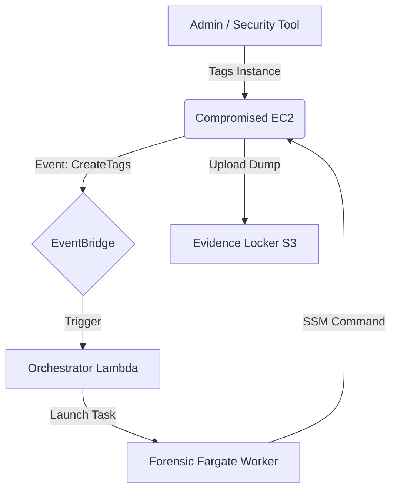

<div align="center">

# 🕵️‍♂️☁️ C-FAK: Cloud Forensic Acquisition Kit
### Automated Memory Acquisition & Forensic Triage for AWS EC2


[](https://aws.amazon.com/)
[](https://hub.docker.com/r/nanobug8/cfak)
[](LICENSE)
[]()

<p align="center">
  <b>Serverless. Event-Driven. Zero Contact.</b><br>
  Capture volatile memory (RAM) and artifacts from compromised instances automatically.
</p>

</div>

---

## 📖 Overview

**C-FAK** is a serverless, event-driven infrastructure designed to reduce the time between detection and evidence preservation. It eliminates manual intervention by automatically capturing volatile memory (RAM) from compromised EC2 instances based on tagging.

> [!WARNING]
> **Compatibility Note:** This tool currently supports **Linux EC2 instances only**. Windows support is currently in development.

---

## 🚀 Architecture & Workflow



## 🐳 Docker Image & Customization

The core forensic logic resides in a Docker container. You can use the default image provided or build your own to include specific tools.

| Component | Detail | Link |
| :--- | :--- | :--- |
| **Image Name** | `nanobug8/cfak` | [View on Docker Hub](https://hub.docker.com/r/nanobug8/cfak) |
| **Tag** | `latest` | |
| **Pull Command** | `docker pull nanobug8/cfak:latest` | |

> [!TIP]
> **Open for Improvements:** Both the infrastructure code and the Docker image are open source. If you want to add new forensic tools or improve the scripts, please feel free to contribute or override the image URI in the CloudFormation template.

---

## 📋 Prerequisites

> [!IMPORTANT]
> **CRITICAL:** The environment must meet these strict requirements for the tool to function.

### 1. CloudTrail
* **Requirement:** Must be **Enabled** in the region.
* **Reason:** The trigger relies on CloudTrail logging the `CreateTags` API call. Without it, EventBridge is blind.

### 2. Network Connectivity
The victim instance needs access to AWS endpoints to receive commands and upload evidence:
* **Public Subnet:** Must have `Auto-assign Public IP` enabled.
* **Private Subnet:** Must have a **NAT Gateway** or **VPC Endpoints** (SSM, S3, Logs).

### 3. AWS Systems Manager (SSM)
The SSM Agent must be installed and running on the victim.
* **Amazon Linux 2 / 2023:** Pre-installed ✅
* **Ubuntu / RHEL:** Install manually via Snap or DEB.

### 4. AWS CLI
Required on the victim instance to perform the final S3 upload.
* *Verification:* Run `aws --version` on the instance.

---

## 🛠️ Deployment Guide

### Step 1: Deploy Infrastructure
Use the provided `cfak-infrastructure.yaml` to deploy the core stack via **AWS CloudFormation**.

**Stack Parameters:**

| Parameter | Default | Description |
| :--- | :--- | :--- |
| `DockerImageUri` | `nanobug8/cfak:latest` | Custom image URI (optional). |
| `VpcId` | *User Input* | VPC with internet access. |
| `SubnetId` | *User Input* | **PUBLIC** subnet (Required for Fargate to pull Docker images). |

### Step 2: Configure the Victim (IAM)
To prepare your fleet (or a specific victim) for forensics, you must attach the correct IAM permissions.

1.  Go to **CloudFormation** > **Outputs** tab.
2.  Copy the Role Name: `ForensicVictimRole`.
3.  Go to **EC2 Console** > Select Instance > **Actions** > **Security** > **Modify IAM Role**.
4.  Attach the role created by the stack (e.g., `c-fak-Victim-Role`).

**Refresh the Agent:**
Run this on the victim instance to apply the new permissions immediately:
```bash
sudo systemctl restart amazon-ssm-agent
```

---

## 🔫 Usage (Triggering Forensics)

Once deployed, the system is passive until triggered.

1.  Go to the **EC2 Console**.
2.  Select the suspicious instance.
3.  **Manage Tags** > **Add Tag**:

    ```text
    Key:   Forensic
    Value: True
    ```

4.  Click **Save**. The automation starts immediately.

---

## 🔍 Verification

How to confirm the process worked:

1.  **Check ECS:** Go to **Clusters** > `c-fak-Cluster`. The Task should change from `PROVISIONING` to `RUNNING`.
2.  **Check S3:** Go to the **Evidence Bucket**. A new folder `i-xxxxxxxx / YYYY-MM-DD` will appear.
3.  **Result:** The `.lime` memory file (and logs) will be present in the folder.

---

## 🚧 Roadmap & Contributing

This project is in **Beta**. We welcome Pull Requests!

- [x] Amazon Linux 2 / 2023 Support
- [x] Ubuntu Support
- [x] RHEL Support
- [ ] **Windows Support** (Coming Soon)
- [ ] EBS Snapshot Acquisition
- [ ] Automated Volatility Analysis

---

<p align="center">
  <sub>MIT License. Use responsibly for authorized forensic analysis only.</sub>
</p>
