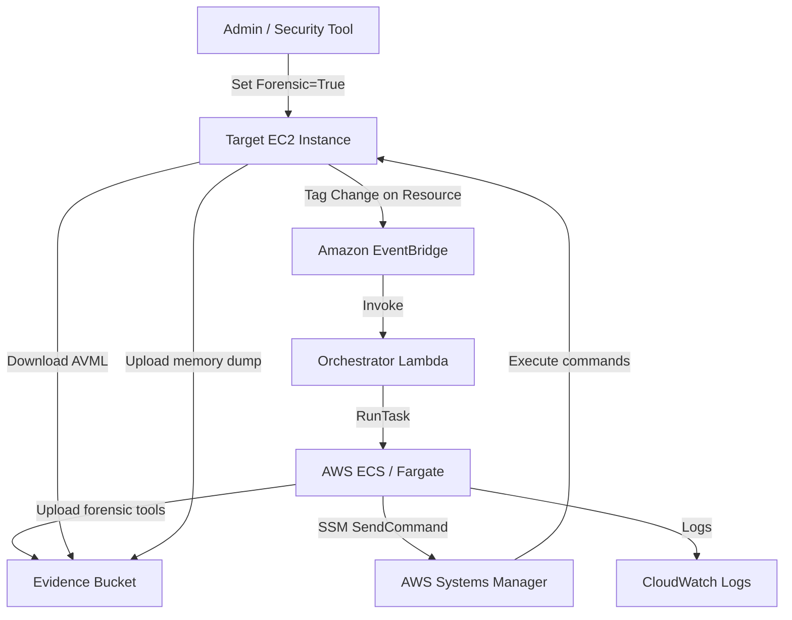

<div align="center">

# 🕵️‍♂️☁️ C-FAK: Cloud Forensic Acquisition Kit

### Automated Memory Acquisition & Forensic Triage for AWS EC2


[](https://aws.amazon.com/)
[](https://hub.docker.com/r/nanobug8/cfak)
[](LICENSE)
[]()

<p align="center">
  <b>Event-Driven. Automated. No Interactive Login Required.</b><br>
  Automatically capture volatile memory (RAM) from AWS EC2 instances triggered by a forensic tag.
</p>

</div>

---

## 📖 Overview

**C-FAK (Cloud Forensic Acquisition Kit)** is an event-driven AWS forensic acquisition framework designed to reduce the time between incident detection and evidence preservation.

The system automatically launches a temporary forensic worker when an EC2 instance receives the tag:

```text
Key:   Forensic
Value: True
```

The forensic workflow is orchestrated using native AWS services:

* **Amazon EventBridge** detects the EC2 tag change.
* **AWS Lambda** identifies the target EC2 instance and starts the forensic worker.
* **Amazon ECS / AWS Fargate** runs the C-FAK forensic controller.
* **AWS Systems Manager (SSM)** executes commands on the target EC2 instance.
* **Amazon S3** stores forensic tools and acquired evidence.
* **Amazon CloudWatch Logs** stores the Fargate controller logs.

The current CloudFormation stack is designed to be **portable** and does **not create, attach, replace, assume, or manage any IAM role on the victim EC2 instance**.

> [!WARNING]
> C-FAK is intended for authorized forensic analysis and incident response. Use only on systems you are authorized to investigate.

---

## 🏗️ Architecture


```mermaid
graph TD

    Admin[Admin / Security Tool]
        -->|Set Forensic=True| EC2[Target EC2 Instance]

    EC2
        -->|Tag Change on Resource| EB[Amazon EventBridge]

    EB
        -->|Invoke| Lambda[Orchestrator Lambda]

    Lambda
        -->|RunTask| ECS[AWS ECS / Fargate]

    ECS
        -->|Upload forensic tools| S3[Evidence Bucket]

    ECS
        -->|SSM SendCommand| SSM[AWS Systems Manager]

    SSM
        -->|Execute commands| EC2

    EC2
        -->|Download AVML| S3

    EC2
        -->|Upload memory dump| S3

    ECS
        -->|Logs| CW[CloudWatch Logs]
```

### Workflow

```text
EC2 tag changed
      │
      ▼
Forensic=True
      │
      ▼
EventBridge
      │
      ▼
Lambda Orchestrator
      │
      ▼
ECS Fargate Task
      │
      ├── Upload AVML / WinPMEM → S3
      │
      ├── Detect EC2 platform
      │
      └── Send SSM command
               │
               ▼
          Target EC2
               │
               ├── Download forensic tool
               ├── Acquire RAM
               └── Upload evidence → S3
```

The EventBridge rule uses AWS's **Tag Change on Resource** event source (`aws.tag`) and filters EC2 instances whose `Forensic` tag changes to `True`.

---

## 🐳 Docker Image

The forensic controller runs inside an ECS Fargate container.

The default image is:

| Component        | Detail                                                  |
| :--------------- | :------------------------------------------------------ |
| **Image**        | `nanobug8/cfak`                                         |
| **Tag**          | `latest`                                                |
| **Docker Hub**   | [nanobug8/cfak](https://hub.docker.com/r/nanobug8/cfak) |
| **Pull command** | `docker pull nanobug8/cfak:latest`                      |

The CloudFormation template allows the container image to be replaced through the `DockerImageUri` parameter.

> [!TIP]
> The Docker image can be customized with additional forensic tooling. Build your own image and provide its URI through the `DockerImageUri` CloudFormation parameter.

---

## 📋 Prerequisites

### 1. AWS Region

C-FAK can be deployed in an AWS region where the required services are available.

The example environment uses:

```text
us-east-1
```

---

### 2. VPC and Fargate Network

The CloudFormation stack does **not create a VPC**. It uses an existing VPC and subnet.

Required parameters:

| Parameter        | Required | Description                |
| :--------------- | :------: | :------------------------- |
| `VpcId`          |     ✅    | Existing VPC               |
| `SubnetId`       |     ✅    | Existing **PUBLIC subnet** |
| `DockerImageUri` |     ❌    | Custom Docker image        |

The subnet supplied to `SubnetId` must have Internet connectivity through an Internet Gateway because the Fargate task receives a public IP.

The current task configuration uses:

```text
Network mode: awsvpc
Launch type: FARGATE
assignPublicIp: ENABLED
```

---

### 3. AWS Systems Manager (SSM)

The target EC2 instance must be managed by **AWS Systems Manager**.

The SSM Agent must be:

* Installed.
* Running.
* Registered as a managed instance.
* Able to communicate with Systems Manager endpoints.

C-FAK does not create or replace the EC2 IAM role.

The role already attached to the EC2 must therefore provide the permissions required for SSM operation.

---

### 4. AWS CLI on the Target EC2

The target EC2 instance must have the AWS CLI installed because the SSM commands executed by C-FAK use commands such as:

```bash
aws s3 cp s3://BUCKET/tools/avml /tmp/avml
```

and:

```bash
aws s3 cp /tmp/MEMORY_FILE s3://BUCKET/evidence/MEMORY_FILE
```

Verify with:

```bash
aws --version
```

---

### 5. IAM Permissions on the Existing EC2 Role

This is an important part of the architecture.

**C-FAK does not create the victim role.**

The target EC2 keeps whatever IAM role is already assigned to it.

That role must allow:

```text
SSM access
+
S3 read access to forensic tools
+
S3 write access to forensic evidence
```

For a quick demonstration environment, an existing EC2 role with:

```text
AmazonS3FullAccess
```

and the appropriate SSM permissions is sufficient.

For production environments, replace broad permissions with a least-privilege policy restricted to the C-FAK bucket.

Example:

```json
{
  "Version": "2012-10-17",
  "Statement": [
    {
      "Sid": "ReadForensicTools",
      "Effect": "Allow",
      "Action": [
        "s3:GetObject"
      ],
      "Resource": "arn:aws:s3:::BUCKET_NAME/tools/*"
    },
    {
      "Sid": "WriteForensicEvidence",
      "Effect": "Allow",
      "Action": [
        "s3:PutObject"
      ],
      "Resource": "arn:aws:s3:::BUCKET_NAME/evidence/*"
    }
  ]
}
```

> [!IMPORTANT]
> `AmazonS3ExpressFullAccess` and `AmazonS3FilesFullAccess` are not substitutes for permissions to a standard Amazon S3 bucket. C-FAK uses a normal S3 bucket.

---

## 🚀 Deployment

### Step 1 — Deploy CloudFormation

Deploy:

```text
cfak-infrastructure.yaml
```

through AWS CloudFormation.

### Parameters

| Parameter        | Default                | Description                     |
| :--------------- | :--------------------- | :------------------------------ |
| `ProjectName`    | `c-fak`                | Prefix used for C-FAK resources |
| `VpcId`          | User input             | Existing VPC                    |
| `SubnetId`       | User input             | Public subnet used by Fargate   |
| `DockerImageUri` | `nanobug8/cfak:latest` | C-FAK Docker image              |

The stack creates the evidence bucket, ECS cluster, Fargate task definition, IAM roles required by C-FAK, Lambda orchestrator, EventBridge rule and CloudWatch log group.

---

## 🔐 IAM Architecture

C-FAK uses separate IAM responsibilities.

### Roles managed by C-FAK

The stack creates:

```text
FargateExecutionRole
FargateTaskRole
LambdaOrchestratorRole
```

The Fargate task role provides permissions for:

```text
SSM:
  ssm:SendCommand
  ssm:GetCommandInvocation
  ssm:ListCommandInvocations

EC2:
  ec2:DescribeInstances
  ec2:DescribeTags
  ec2:DescribeVolumes
  ec2:CreateSnapshot
  ec2:CreateTags

S3:
  s3:ListBucket
  s3:GetObject
  s3:PutObject
```

These permissions belong to the C-FAK worker and are not attached to the target EC2.

### Role of the target EC2

The target instance keeps its existing IAM role.

C-FAK:

```text
❌ does not create it
❌ does not attach it
❌ does not replace it
❌ does not assume it
```

The CloudFormation output explicitly identifies the victim IAM role as externally managed.

This allows C-FAK to be deployed into environments where EC2 instances already use organizational IAM roles.

---

## 🗄️ Evidence Storage

The stack automatically creates an S3 bucket:

```text
<ProjectName>-evidence-<AWS Account ID>-<AWS Region>
```

For example:

```text
c-fak-evidence-265733122078-us-east-1
```

The bucket is configured with:

* Public access blocked.
* AES-256 server-side encryption.
* Glacier transition after 30 days.
* Automatic expiration after 365 days.

### Bucket structure

During an acquisition, C-FAK uses:

```text
tools/
    avml
    winpmem.exe

evidence/
    i-xxxxxxxxxxxxxxxxx_memory.lime
```

The forensic controller uploads the acquisition tools to `tools/` before issuing the SSM acquisition command.

---

## 📊 Resources Created

The CloudFormation stack creates:

| Resource                   | Purpose                       |
| :------------------------- | :---------------------------- |
| **S3 Bucket**              | Tools and forensic evidence   |
| **CloudWatch Log Group**   | Fargate forensic logs         |
| **Security Group**         | Network access for Fargate    |
| **ECS Cluster**            | C-FAK container execution     |
| **ECS Task Definition**    | Defines the forensic worker   |
| **Fargate Execution Role** | ECS image/log execution       |
| **Fargate Task Role**      | C-FAK AWS permissions         |
| **Lambda Role**            | Orchestrator permissions      |
| **Lambda Function**        | Starts forensic tasks         |
| **EventBridge Rule**       | Detects `Forensic=True`       |
| **Lambda Permission**      | Allows EventBridge invocation |

The stack does **not** create resources for the target EC2 IAM role.

---

## 🗺️ Roadmap

* [x] Automated event-driven acquisition
* [x] Amazon Linux support
* [x] Ubuntu support
* [x] RHEL support
* [x] Automated S3 evidence storage
* [x] Fargate-based forensic worker
* [x] SSM-based remote acquisition
* [x] Portable IAM architecture
* [ ] Windows acquisition hardening and validation
* [ ] EBS Snapshot Acquisition
* [ ] Automated Volatility Analysis
* [ ] Extended forensic artifact collection
* [ ] Multi-instance acquisition orchestration

---

## 🤝 Contributing

C-FAK is an open-source project and contributions are welcome.

Possible contribution areas include:

* Additional forensic acquisition tools.
* New operating-system support.
* Evidence validation.
* EBS acquisition.
* Automated forensic analysis.
* Improved IAM least-privilege policies.
* Additional EventBridge triggers.
* Detection and incident-response integrations.

Infrastructure and Docker components can be customized independently.

---

## ⚠️ Disclaimer

C-FAK is intended for authorized forensic analysis, incident response, testing and research.

Do not deploy or execute forensic acquisition against systems without appropriate authorization.

---

<p align="center">
  <sub>MIT License. Use responsibly for authorized forensic analysis only.</sub>
</p>
